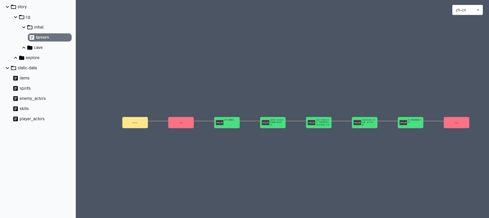
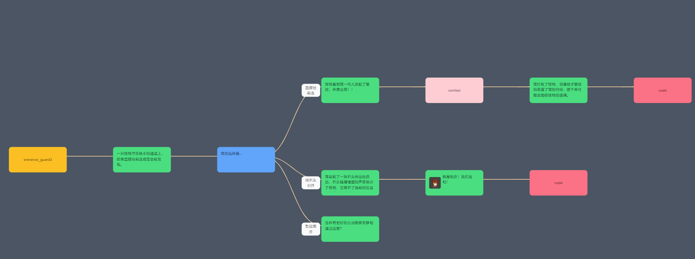
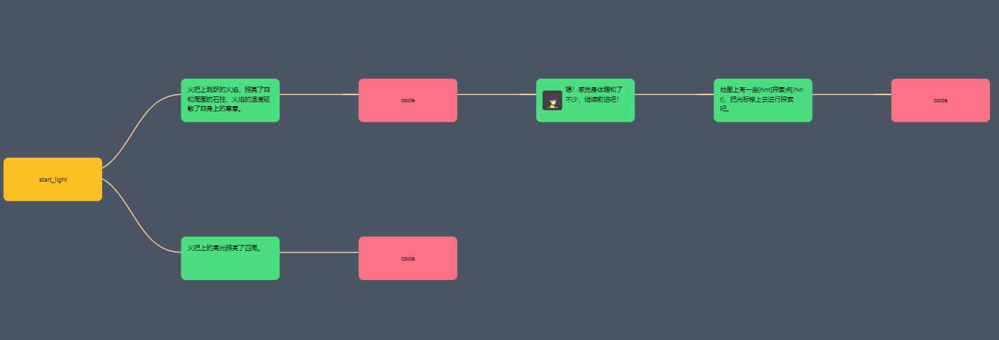
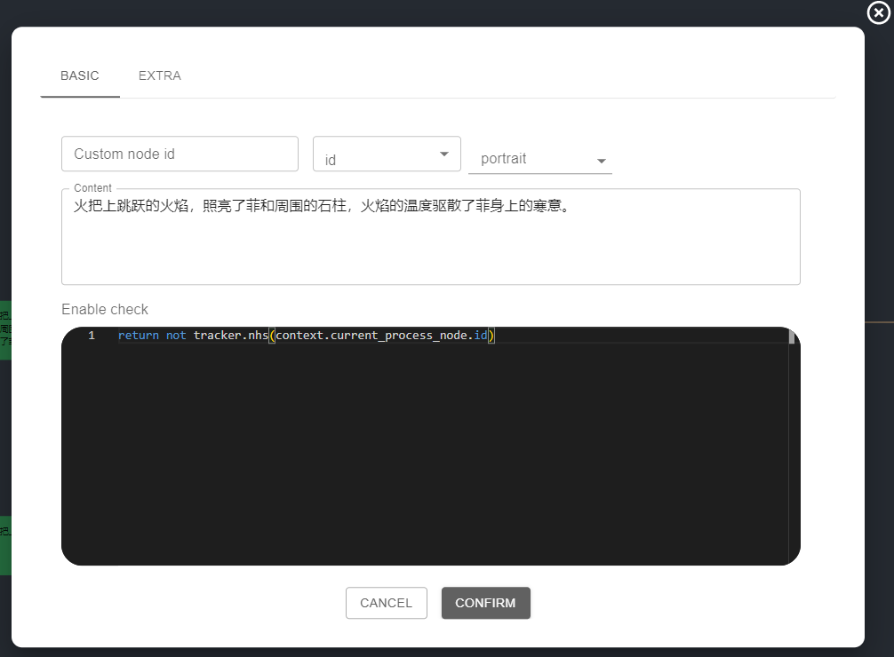
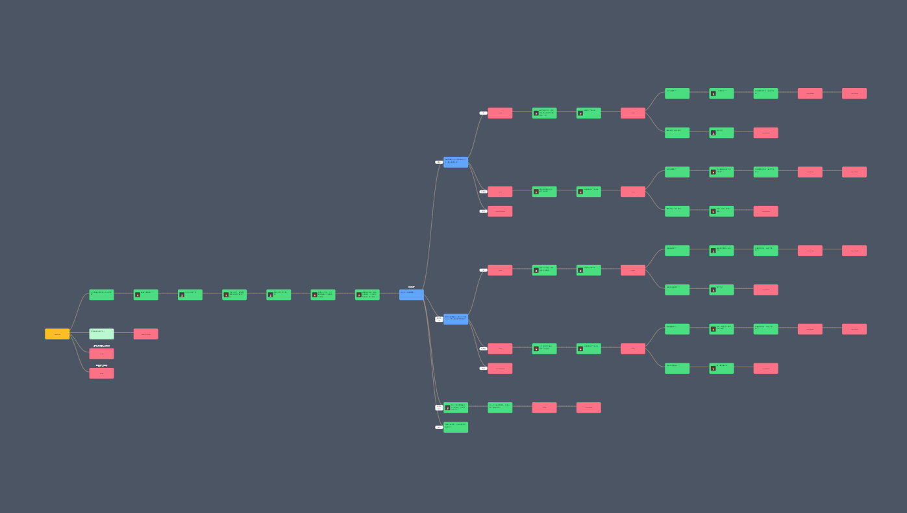
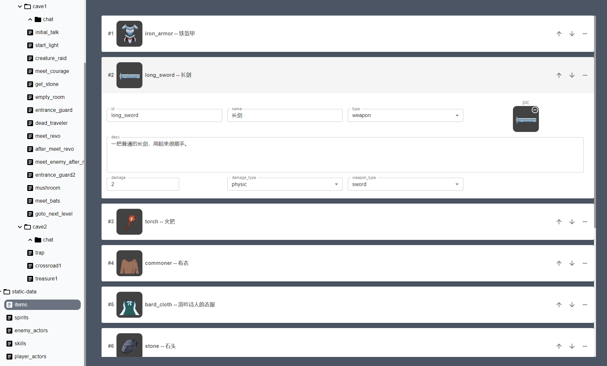

# Shovel DB

一体化的游戏数据库，主要用来管理剧情和静态数据。

### 截图








### story 的各项操作快捷键

- 新增子 sentence 节点：Tab
- 新增子 branch 节点：Ctrl+Tab
- 新增子 action 节点：Ctrl+Shift+Tab
- 新增同级 sentence 节点：Enter
- 新增同级 branch 节点：Ctrl+Enter
- 新增同级 action 节点：Ctrl+Shift+Enter
- 编辑选中节点：E
- 移动节点：拖拽
- 删除节点：Backspace
- 复制选择节点：Ctrl+C
- 复制选择节点及对应子节点：Ctrl+Shift+C
- 粘贴节点：Ctrl+V
- 粘贴节点内容：Ctrl+Shift+V
- 最近文件：Ctrl+P
- 命令版：Ctrl+Shift+P

### schema API 文档

每个 `field` 中的结构如下：

| 配置项 | 功能                                                         | 是否必填 |
| ------ | ------------------------------------------------------------ | -------- |
| type   | 定义字段的类型，`string`，`object`，`number`、`array`、`select`、`file` | 是       |
| config | 对应类型的细分配置信息                                       | 否       |
| name   | 字段在界面上展示的名字                                       | 否       |


如果类型为 `object`，配置项需要新加一个配置项 `fields`，用来描述对应 `object` 拥有哪些字段，示例：

```json
{
    "type": "object",
    "fields": {
        "id": {
            "type": "string",
            "config": {
                "colSpan": 3,
                "type": "singleline"
            }
        },
        "name": {
            "type": "string",
            "config": {
                "colSpan": 3,
                "type": "singleline"
            }
        },
        "desc": {
            "type": "string",
            "config": {
                "colSpan": 6,
                "type": "multiline"
            }
        }
    }
}
```

如果类型为 `array`，配置项需要新加一个配置项 `fieldSchema`，用来描述对应 `array` 子项的数据结构，示例：

```json
{
    "type": "array",
    "fieldSchema": {
        "type": "string",
        "config": {
            "type": "multiline"
        }
    }
}
```

所有类型的通用配置：

| 配置项       | 功能                                  | 默认值                                                       |
| ------------ | ------------------------------------- | ------------------------------------------------------------ |
| colSpan      | 该项数据在卡片中的宽度占比(总宽度 12) | 类型为 object、array 是 12，string、number 是 3              |
| defaultValue | 该项数据的默认值                      | 对应类型的默认值                                             |
| enableWhen   | 该项数据根据条件确定是否存在，js 函数 | 无，示例："enableWhen": "(obj) => obj.name === 'good'"，其中 obj 为当前字段所在的对象 |


object:

| 配置项        | 功能                                                         | 默认值                                                 |
| ------------- | ------------------------------------------------------------ | ------------------------------------------------------ |
| summary       | 卡片标题内容，可支持数据格式化，通过 {{your_property}} 来引用属性值 | "{{___key}}"，\_\_\_key 为特殊标记，表示当前的字段名称 |
| initialExpand | 是否默认展开数据                                             | true                                                   |


array:

| 配置项        | 功能                                                         | 默认值                                                       |
| ------------- | ------------------------------------------------------------ | ------------------------------------------------------------ |
| summary       | 子项卡片标题内容，可支持数据格式化，通过 {{your_property}} 来引用属性值 | "{{___index}}"，\_\_\_index 为特殊标记，表示当前子项的序列号 |
| initialExpand | 是否默认展开数据                                             | false                                                        |


string:

| 配置项                  | 功能                                                     | 默认值                                                       |
| ----------------------- | -------------------------------------------------------- | ------------------------------------------------------------ |
| type                    | 文本类型,"singleline" 为单行编辑，"multiline" 为多行编辑, "code" 为代码 | "singleline"                                                 |
| height                  | 文本框的行高，type=multiline 或者 type=code 时才生效       | "200px"                                                      |
| needI18n                | 是否需要国际化,当 type=code 时不生效                                           | false                                                        |
| codeLang                | type="code" 时可用,值为 monca editor 的可选语言，目前只支持 "json" 和 "python" | ""                                                        |


number:

| 配置项                  | 功能                                           | 默认值                                                       |
| ----------------------- | ---------------------------------------------- | ------------------------------------------------------------ |
| type                    | 数值类型,"int" 为整数，"float" 为浮点数        | "float"                                                      |


select:

| 配置项  | 功能                                                      | 默认值 |
| ------- | --------------------------------------------------------- | ------ |
| options | 选项列表，数组格式为 [{ "label": "Test", "value": "test"}] | []     |
